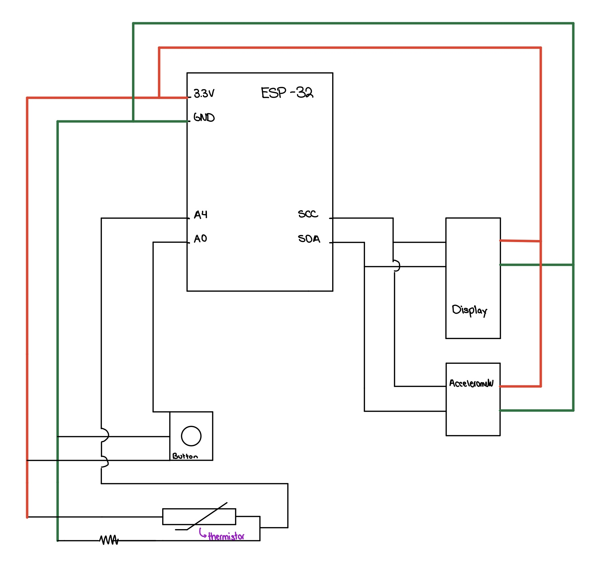
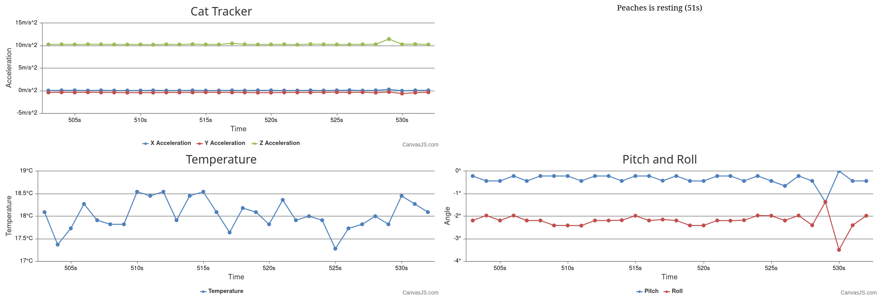

# Cat Tracker

Authors: Joshua Arrevillaga, Michael Barany, Sam Kraft, and Alicja Mahr

Date: 2024-10-25

### Summary

The purpose of this quest is to familiarize oneself with aplhanumeric LED display and several components such as an accelerometer and a thermistor for the purpose of measuring the behaviors of a cat. The device should be able to track activity, time in activity (with Hours, Minutes, and Seconds), as well as the temperature and display that information on the LED display alongside the name of the cat (Peaches) which can be filtered through/ scrolled using a button. This collected information should also be transmitted and displayed on a laptop to show a time series graph represenatation of the information.

### Solution Design

The solution was created using an ESP-32 board alongside a button, a thermistor, an accelerometer, and a Adafruit 14-Segment Alphanumeric LED to display the aquired information on the 'cat collar'. As can be seen in the cirucit diagram below, the ESP32 is connected to a laptop and all the aforementioned components wired to the ESP device. The Aphanumeric display API was provided by the EC444 course admin but it was modified for our purpose.
- The Button is connected to A0 which measures the button state (pressed or not pressed)
- The Thermistor is wired to A4 which takes in a voltage amount dependant on the resistance induced by the ambient air within the thermistor. That data is then interpreted using our code to determine the corresponding temperate amount in ºC
- The Accelerometer and the Display are connected to I2C allowing several devices to be connected to the same ports (SCL and SDA) to take in the Accelerometer information and display the required data on the LED display.
- Then when the button is pressed, the display will alternate between showing the cat's name, the current local time, and the cats status (active, inavtive, upside down). The cats status is determined by using the magnitude of the acceleration or using the z coordinate for the upside down state.
- All of this data is displayed on plots having been made using canvas.js stripcharts.

Cat Tracker Circuit Diagram

- The button is connect by passing a signal from 3V to the button and then the output passes through a resistor and then to A2.
- Both the Alphanumeric LED Display and Acceleromenter are passed a 3V input and ground and the outputs go to SDA and SCL where I2C but is used to allow both signals to pass through the same pins.
- The thermistor is connected to 3V and A4.

This is diplayed as follows:

Cat Tracker Plot Display

This was done using JavaScript Code with node.js and the existing plot archetypes aquired from CanvasJS.

### Quest Summary
The implementation of the button for this skill was quite tricky, we ran into some issues where sometimes it wouldn't accept the input and wouldn't do anything or where the input would be accepted and cause a crash becuase of he way we were implementing it. In the end we got it to work: the accelerometer inputs, the thermistor input, and the button press being accepted to cause a chnage in the display of the display where if the text > 4 it would scroll the values. With regard to things we would do differently we would definitely would on it in advance and take the necessary time to spend on the project.

### Supporting Artifacts
- [Link to video technical presentation](https://drive.google.com/file/d/1wBbOFCfhmCuw4so7rMala_k99iSrlLGD/view?usp=sharing)
- [Link to video demo](https://drive.google.com/file/d/1UEfef47YH-UFa3SOFJjnss_7nn2BzvAN/view?usp=sharing)
  
### Self-Assessment 

| Objective Criterion | Rating | Max Value  | 
|---------------------------------------------|:-----------:|:---------:|
| Objective One | 1 |  1     | 
| Objective Two | 1 |  1     | 
| Objective Three | 1 |  1     | 
| Objective Four | 1 |  1     | 
| Objective Five | 1 |  1     | 
| Objective Six | 1 |  1     | 
| Objective Seven | 1 |  1     | 

### AI and Open Source Code Assertions

- We have documented in our code readme.md and in our code any software that we have adopted from elsewhere
- We used AI for coding and this is documented in our code as indicated by comments "AI generated" 

