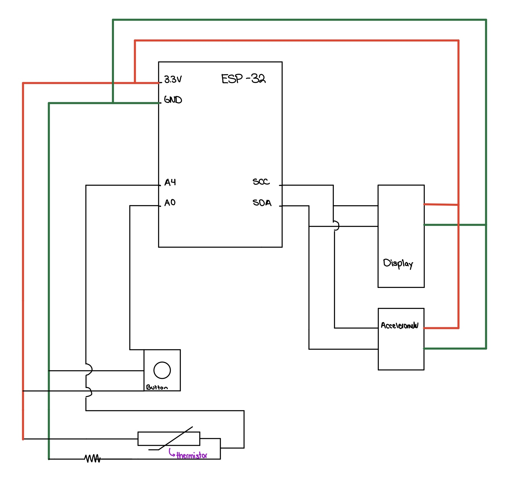
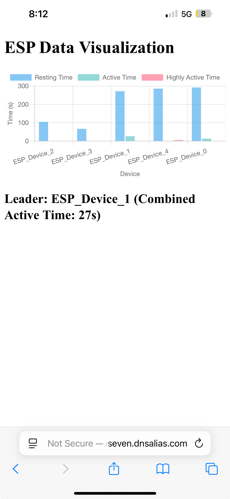

# Quest 3: FitCat

Authors: Michael Barany, Joshua Arrevillaga, Samuel Kraft

Date: 2024-12-1

# ESP32 Activity Tracking and Visualization System

## **Summary**

The FitCat system is an ESP32 activity tracking and visualization solution designed to monitor and compare activity states across multiple devices. The system builds on previous work, enabling multiple ESP32 devices to connect via Wi-Fi and transmit acceleration and activity data to a central Node.js server. The collected data is processed and presented in a web portal, which is hosted on a Raspberry Pi and accessible via port forwarding and DDNS.

Each ESP32 device, "Cat Tracker," determines activity states such as resting, active, and highly active using accelerometer data. These trackers send their data to the central server via UDP, where it is analyzed to identify the "leader" among all connected devices. Leadership is based on the cumulative time spent in the active and highly active states over the past 10 minutes. When a new leader is identified, the server sends commands back to the devices to update their status and trigger LED blink alerts, ensuring all devices are notified of the change.

The central Node.js server serves multiple roles: it processes incoming data, maintains leader tracking, and powers a web-based dashboard. The dashboard provides real-time visualization of activity data using Chart.js and highlights the leading device for the activity metric. This dashboard is accessible through any browser and is designed to be responsive and user-friendly.

Additionally, video from a Pi camera can be streamed to a client machine.

The ESP devices are able to connect to the wifi network. server IP and port settings for UDP communication, and I2C settings for accelerometer operation. The Node.js server is configured to handle UDP communication on port 33333 and host the dashboard on port 3000. This means that we are able to use DDNS to access the website from any device not on the network by searching the web address and accessing that port.

---

## **Circuit**

Circuit Diagram (same as Quest 3 with additional functionality coded)

## **Features**

### **ESP32 Firmware**
The ESP32 devices are configured to:
- **Wi-Fi Connectivity**:
  - Connect to a designated Wi-Fi network for seamless communication.
- **UDP Communication**:
  - Transmit accelerometer data and activity states to a server.
  - Handle incoming commands, such as designating a "new leader" device.
- **Activity Tracking**:
  - Use accelerometer data to determine the current activity state and track the time spent in each state (resting, active, or highly active).
- **LED Blink Control**:
  - Blink the onboard LED whenever a device becomes the new leader.

### **Node.js Application**
The server-side application, written in Node.js, performs the following tasks:
- **Receive Data**:
  - Collect real-time activity data from multiple ESP32 devices over UDP.
- **Process and Store**:
  - Analyze the incoming data and identify "leaders" for each activity metric.
- **Send Commands**:
  - Transmit commands back to ESP32 devices, such as triggering LED blinks for leaders.
- **Host Front-End**:
  - Serve a web-based dashboard using an Express HTTP server.
- **Real-Time Updates**:
  - Use Socket.IO to update the dashboard dynamically with incoming data.

### **Front-End**
- **Visualization**:
  - Displays activity times (resting, active, highly active) for each ESP32 device using **Chart.js**.
- **Leader Tracking**:
  - Highlights the leading devices for the activity metric in real time.
- **Responsive Dashboard**:
  - A web interface hosted on the Raspberry Pi, accessible via port forwarding and DDNS.

Node.js sever running on DDNS server not on wifi

### Quest Potential Improvements

1. The code all worked as intended but we did run into some time management issues due to previous minsmanagement.

### Supporting Artifacts
- [Link to video technical presentation](https://drive.google.com/file/d/1t9nFaT09z_1RR7IJQeNT06oH9jQJouNM/view?usp=sharing)
- [Link to video demo](https://youtu.be/zWKxVCXcrlw)

### Self-Assessment 

| Objective Criterion | Rating | Max Value  | 
|---------------------------------------------|:-----------:|:---------:|
| Objective One | 1 |  1     | 
| Objective Two | 1 |  1     | 
| Objective Three | 1 |  1     | 
| Objective Four | 1 |  1     | 
| Objective Five | 1 |  1     | 
| Objective Six | 1 |  1     | 
| Objective Seven | 1 |  1     | 

### AI and Open Source Code Assertions

- We have documented in our code readme.md and in our code any software that we have adopted from elsewhere
- We used AI for coding and this is documented in our code as indicated by comments "AI generated" 

