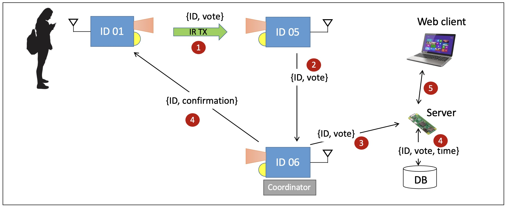
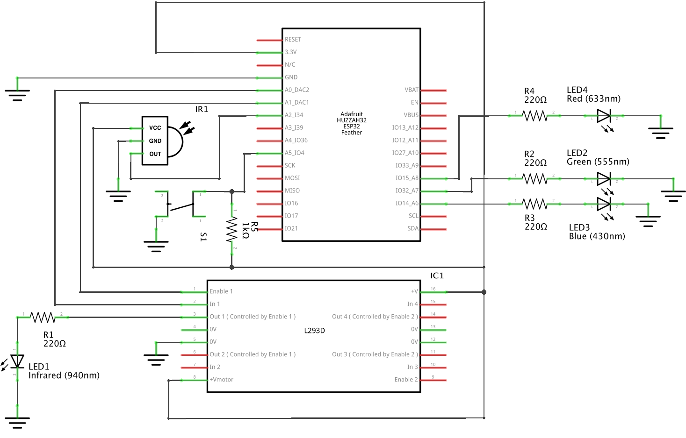
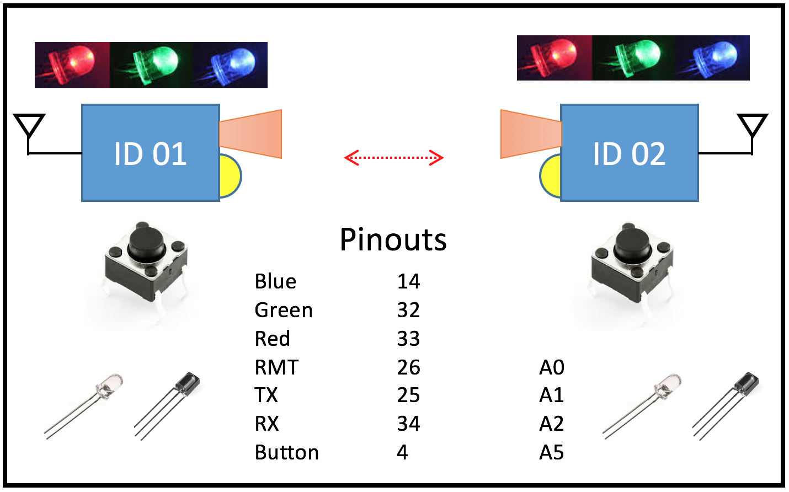
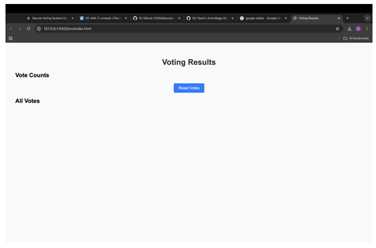
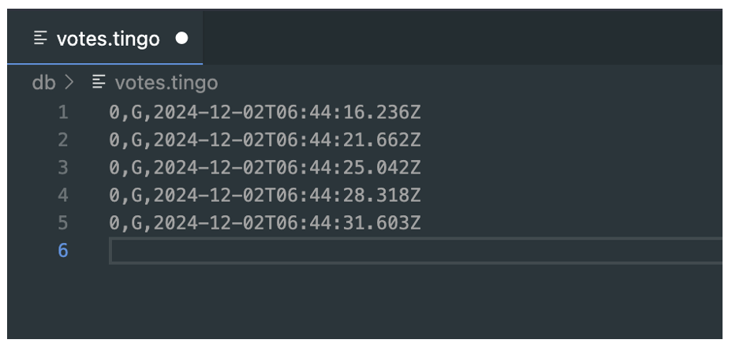

# Quest 4: Secure E-Voting
Authors: Joshua Arrevillaga, Michael Barany, Samuel Kraft 

Date: 2024-11-12

The Secure E-Voting System implements a distributed Internet of Things (IoT) solution that uses ESP32 microcontrollers for communication and a Raspberry Pi server to manage a centralized database and web interface. The project integrates key features such as leader election, real-time vote logging, and dynamic visualization of results. It is designed to ensure reliability and security in electronic voting by leveraging robust communication protocols, fault-tolerant mechanisms, and real-time updates to the user interface. Votes cast by ESP32 devices are processed and stored in a database on the server, with results displayed dynamically via a user-friendly web interface.

At the core of the system is a leader election protocol, implemented using the Bully Algorithm, which ensures that one ESP32 node is designated as the leader. The leader node is responsible for managing incoming votes and forwarding them to the server for persistent storage. Votes are cast using button presses or simulated NFC via UART communication and are transmitted to the leader over UDP. Each ESP32 device provides visual feedback through LEDs to indicate its current state: blue for leader, green for follower, and red for error or timeout. This enhances the user experience by making system states clear and easy to understand.

The server, hosted on a Raspberry Pi, acts as the backbone of the system. It listens for incoming vote data over UDP, processes the information, and stores it in a TingoDB database for persistence. A Node.js application powers the server-side logic, offering REST API endpoints to retrieve vote counts and reset the database. Additionally, the server hosts a web interface that provides real-time visualizations of vote counts and detailed logs. The interface dynamically updates using polling, ensuring that users always have access to the latest data. A reset feature allows administrators to clear the database for new voting sessions.

The overall architecture of the system is designed for fault tolerance and scalability. If a leader node fails, the system automatically initiates a new leader election to ensure continued operation. The combination of distributed hardware, centralized data management, and real-time visualization makes this project a robust solution for secure electronic voting. The integration of ESP32 devices with a Raspberry Pi server and a dynamic web interface demonstrates a seamless blend of hardware and software components, delivering an effective and user-friendly voting platform.

Questions: 

1. Intercepting and Altering Votes via UDP Communication
Intercepting and altering votes during UDP communication is a significant vulnerability, as UDP does not provide inherent security. An attacker could capture vote packets, modify the data, and send them to the server, compromising the voting process. To mitigate this, encryption protocols like Datagram Transport Layer Security (DTLS) can be implemented to secure the packets during transmission, ensuring that the vote data remains confidential and untampered. Additionally, introducing message authentication codes (MACs) or digital signatures can verify the authenticity and integrity of each vote packet, preventing unauthorized alterations. Assigning unique session keys to each ESP32 device would also help, as only authenticated devices with valid keys can send or receive packets, making it difficult for attackers to spoof or intercept communications.

2. Compromising the Leader Node
The leader node, responsible for managing and forwarding votes, is a critical component of the system, and its compromise could lead to vote manipulation or disruption. An attacker could tamper with the leader node, preventing legitimate votes from being processed or altering the data before forwarding it. This issue can be mitigated by implementing redundant monitoring systems among follower nodes. These nodes would continuously monitor the leader’s heartbeat messages and detect anomalies, prompting a leader re-election if the current leader is compromised. Incorporating hardware-based tamper-detection mechanisms, such as security modules on the ESP32 devices, would add another layer of protection against unauthorized access. Additionally, requiring the leader to periodically send a checksum of logged votes to the server allows for verification of data integrity, ensuring that any tampering is quickly identified and addressed.

3. Database Manipulation on the Server
The server’s database is another potential point of attack, where unauthorized access could allow an attacker to modify or delete stored vote records, undermining the integrity of the results. To mitigate this, robust access control mechanisms should be implemented, such as enforcing role-based access control (RBAC) to limit who can access the database. Multi-factor authentication (MFA) for administrators further enhances security by requiring multiple layers of verification. To ensure data integrity, cryptographic hashing can be used to generate signatures for each vote record, allowing for periodic integrity checks that detect unauthorized changes. Additionally, an immutable audit log should be maintained to record all database operations. This log would help in identifying suspicious activity and provide a reliable history of all actions taken, ensuring transparency and accountability in the voting system.

### Quest Summary
Summarize your results and call out any challenges or things you would
have done differently.

Results: 

Challenges: 
  - Time constraints due to poor time management skills 
  - Underestimated the time needed to complete Skill 25

### Supporting Artifacts
- <a href="https://drive.google.com/file/d/1Bo1-dEcYi_JOO4R_xKYUHa2FL7eVNwj8/view?usp=sharing"> [Link to video technical presentation] </a> Not to exceed 120s
- <a href="https://youtu.be/KGbgVObpdLU"> [Link to video demo] </a> Not to exceed 120s

### Self-Assessment 

| Objective Criterion | Rating | Max Value  | 
|---------------------------------------------|:-----------:|:---------:|
| Objective One | 1 |  1     | 
| Objective Two | 1 |  1     | 
| Objective Three | 1 |  1     | 
| Objective Four | 1 |  1     | 
| Objective Five | 1 |  1     | 
| Objective Six | 1 |  1     | 
| Objective Seven | 1 |  1     | 

### AI and Open Source Code Assertions

- We have documented in our code readme.md and in our code any software that we have adopted from elsewhere
- We used AI for coding and this is documented in our code as indicated by comments "AI generated" 

