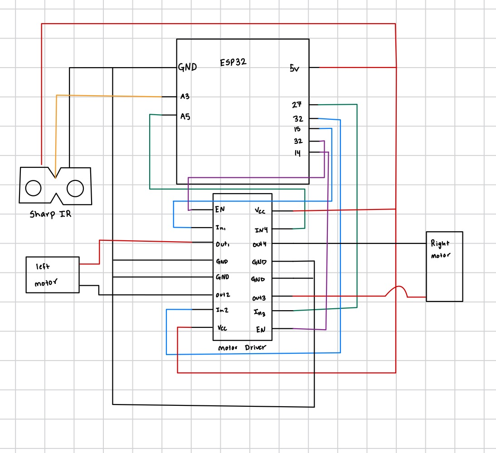
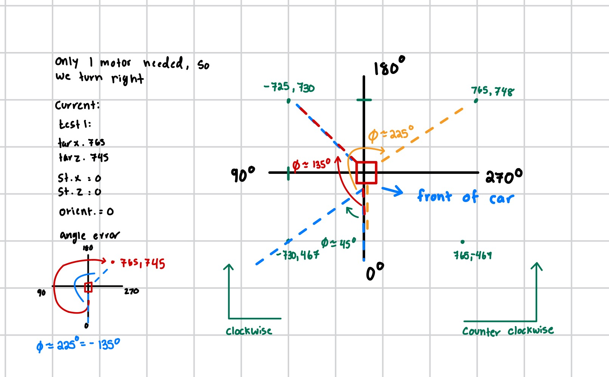
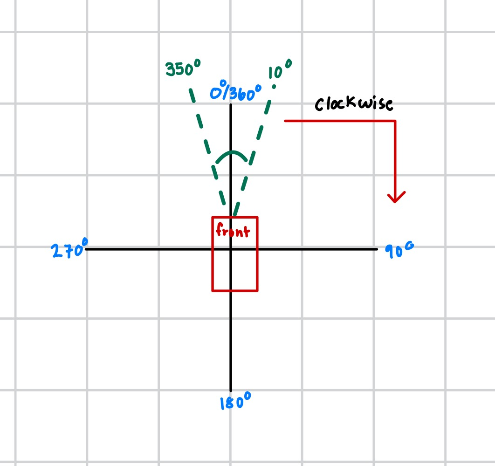

# Personal Assistive Robot

Authors: Joshua Arrevillaga, Michael Barany, Samuel Kraft

Date: 2024-12-10

### Summary

The Personal Assistive Robot project showcases an advanced system for autonomous indoor robot navigation, built around ESP32 microcontrollers and the Optitrack motion capture system. The project integrates real-time positional tracking, obstacle avoidance, and manual control through a keyboard interface, creating a versatile and efficient navigation solution. By combining precise positional data, obstacle detection, and dynamic visualization, the robot navigates predefined waypoints with minimal errors while offering seamless manual override capabilities.

The robot’s navigation is powered by an ESP32 microcontroller, which calculates positional errors using real-time data from Optitrack. Angular errors and distances to waypoints are computed to align the robot’s movement accurately. The integration of a Sharp IR sensor allows the system to detect and avoid obstacles dynamically, ensuring collision-free operation. In addition to autonomous navigation, the system includes a WASD-based remote control mode, enabling manual intervention when needed. Both modes work cohesively, highlighting the flexibility of the system.

Real-time data visualization was implemented using Streamlit, offering both live and historical tracking of the robot’s movements. The visualization interface retrieves data from a Node.js server that stores positional information in a TingoDB database. This setup allows users to monitor the robot’s position in real-time and review its movement history, making the system intuitive and user-friendly. Fixed coordinate bounds and configurable time ranges enhance the utility of the visualizations, supporting precise analysis of the robot’s behavior.

The project presented several challenges that required iterative problem-solving and testing. Calculating angular errors to align with the robot’s coordinate system was particularly complex, necessitating careful normalization and adjustments. Another challenge involved calibrating the motors to ensure smooth and consistent movement, as any imbalance could disrupt the robot’s path. Combining the WASD control, Optitrack-based autonomous navigation, and sensor-based obstacle detection into a cohesive system required extensive debugging to synchronize the various tasks and ensure seamless operation.

This project demonstrates the successful integration of hardware and software components to achieve reliable and efficient robot navigation. By leveraging UDP communication for real-time data exchange, precise motor control, and robust visualization tools, the system balances autonomy with user control. The ability to dynamically switch between control modes, combined with real-time positional tracking, highlights the system’s versatility and scalability.

Despite some challenges, the project outcomes were highly successful. The system reliably navigated through waypoints, avoided obstacles, and provided clear visual feedback through the Streamlit interface. With additional refinements, such as optimizing obstacle detection algorithms or enhancing data visualization, the system could be further improved for real-world applications.

## car.c functions
  - motor_init(): Initializes the motor control pins and PWM configuration. It sets up GPIO pins for motor direction control and configures PWM timers and channels to generate signals for motor speed regulation.

  - set_motor_state(): Controls the motor states by setting GPIO levels for motor direction and applying calibrated PWM signals for speed. This function enables precise movement adjustments, such as forward, backward, and turning.

  - parseRobotData(): Parses positional data received from the Optitrack server. Extracts information like the robot’s ID, position (x, z), orientation (theta), and status. Updates the robot's data structure with the parsed values.

  - udp_client_task(): Sends requests to the Optitrack server for positional updates via UDP. Receives and processes responses containing the robot's position and orientation data, which are used for navigation calculations.

  - udp_wasd_server_task(): Listens for keyboard inputs sent over UDP for manual WASD-based robot control. It updates the robot's mode and motor states based on the received commands and toggles between manual and autonomous control modes.

  - timeout_callback(): Stops the robot if no commands are received within a specified timeout period. Ensures safety by preventing the robot from moving indefinitely without active control.

  - reset_timeout_timer(): Resets the timeout timer whenever a command is received. Keeps the robot responsive and ensures the timeout mechanism functions correctly.

  - wifi_init_sta(): Sets up the ESP32 in station mode to connect to a Wi-Fi network. Configures the SSID and password, initializes network interfaces, and establishes a connection to enable communication with the server.

  - compute_angle_error(): Calculates the angular error between the robot’s current orientation and the target waypoint. This error is used to determine how the robot should adjust its direction to align with the target.

  - compute_distance_to_target(): Computes the Euclidean distance between the robot's current position and the target waypoint. This distance is used to determine when the robot has reached its waypoint.

  - perform_timed_turn(): Executes incremental timed turns to correct angular errors. The robot continuously checks the angle error and adjusts its direction until it is within a small threshold.

  - drive_straight(): Moves the robot forward while periodically checking for angular drift and making small corrections to maintain a straight path toward the target waypoint.

  - ir_sensor_task(): Reads data from the Sharp IR sensor to measure distances to obstacles. Converts ADC readings into voltage and then into distance values. Updates a global variable to indicate the proximity of obstacles.

  - task1(): Implements the robot's main state machine. Based on the current state (STATE_STOP, STATE_TURN, STATE_DRIVE_STRAIGHT), it determines the robot’s behavior and transitions between states as needed.

  - wasd_task(): Processes WASD keyboard commands for manual control. Maps each input (w, a, s, d, 0) to a specific motor state to control the robot’s movement.

### Supporting Artifacts
- [Link to video technical presentation](https://youtu.be/8MVhHsm_MdI).
- [Link to video demo](https://youtu.be/Ix60cpZUb1U). 

### Quick note: 
We forgot to take screenshot of streamlit but in demo you can see it. In the video you agreed it worked. 

### Self-Assessment 

| Objective Criterion | Rating | Max Value  | 
|---------------------------------------------|:-----------:|:---------:|
| Objective One | 1 |  1     | 
| Objective Two | 1 |  1     | 
| Objective Three | 1 |  1     | 
| Objective Four | 1 |  1     | 
| Objective Five | 1 |  1     | 
| Objective Six | 1 |  1     | 
| Objective Seven | 1 |  1     | 

### AI and Open Source Code Assertions

- (https://docs.espressif.com/projects/esp-idf/en/v4.3/esp32/api-reference/peripherals/mcpwm.html)
- chat.openai.com
- EC444 github documentation

