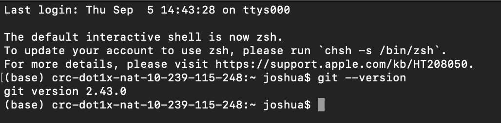
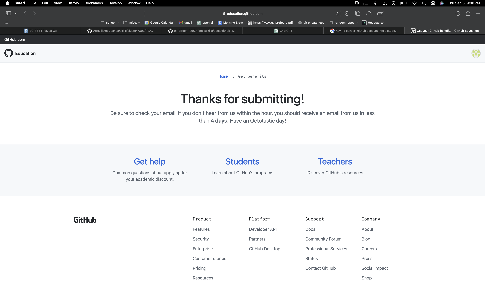
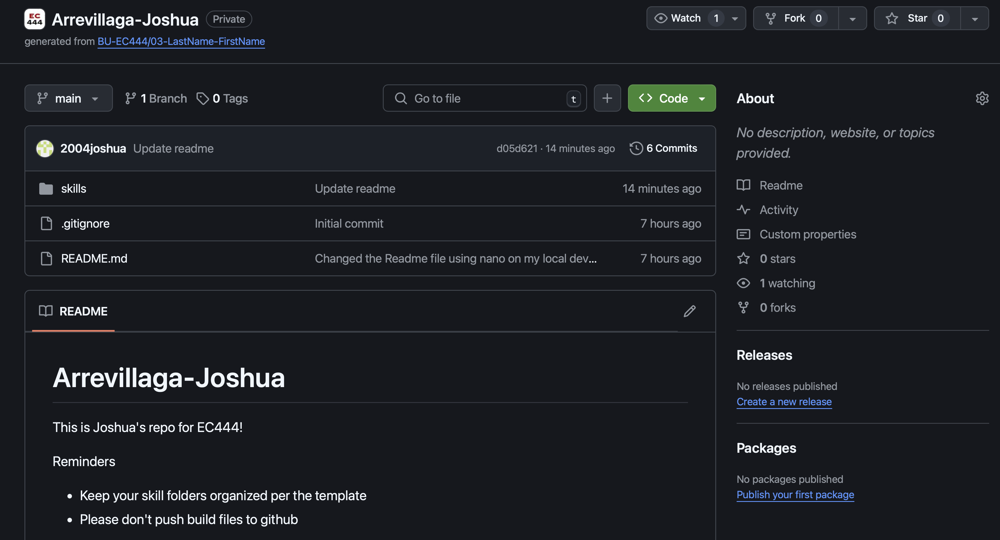

#  Skill Name

Author: Joshua Arrevillaga 

Date: 2024-09-05

### Summary

-I posted my github name, 2004joshua, on the piazza and got added to the organization
-Im editing all the readme files for each skill to prove I did the assignment
-I use the git command line tool for source control, i just got the ssh key to clone it and used git clone git@github.com:BU-EC444/Arrevillaga-Joshua.git
- to commit and push i use
  -git add filename
  -git commit -m "message" 
  -git push

### Evidence of Completion
- Attach a photo or upload a video that captures a demonstration of
  your solution. Include in the photo/video your BU ID.

Template for Including Graphics

Template for Including Graphics

Template for Including Graphics

Or

- [Link to video demo](). Not to exceed 10s

### AI and Open Source Code Assertions

- I have documented in my code readme.md and in my code any
software that we have adopted from elsewhere
- I used AI for coding and this is documented in my code as
indicated by comments "AI generated" 

