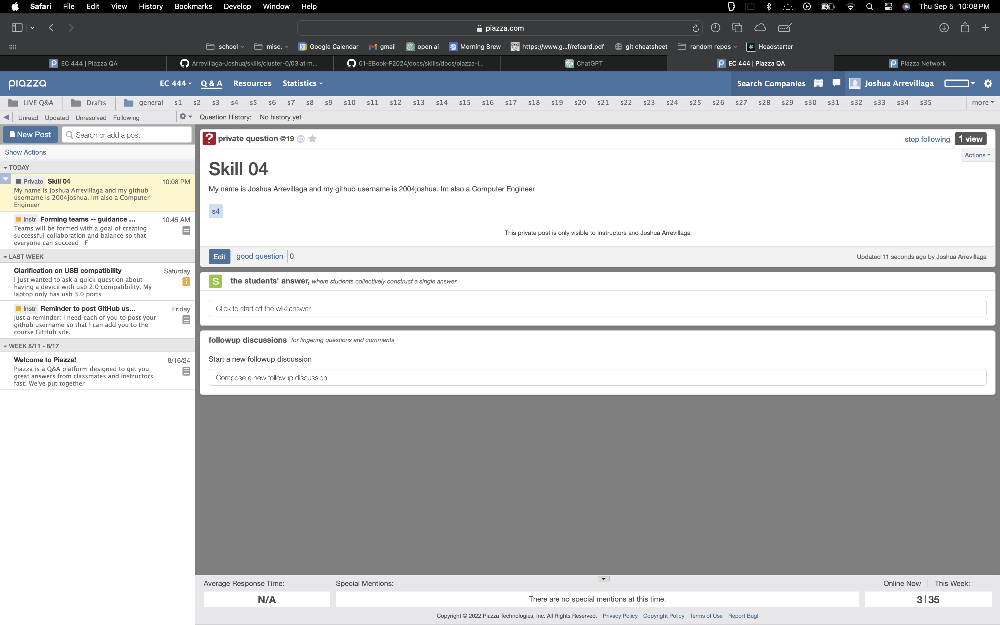

#  Skill Name

Author: Joshua Arrevillaga 

Date: 2024-09-05

### Summary

-Made a post on piazza stating my name major and github name
-put a profile picture as stated

### Evidence of Completion

- Attach a photo or upload a video that captures a demonstration of
  your solution. Include in the photo/video your BU ID.

Template for Including Graphics

Or

- [Link to video demo](). Not to exceed 10s

### AI and Open Source Code Assertions

- I have documented in my code readme.md and in my code any
software that we have adopted from elsewhere
- I used AI for coding and this is documented in my code as
indicated by comments "AI generated" 

