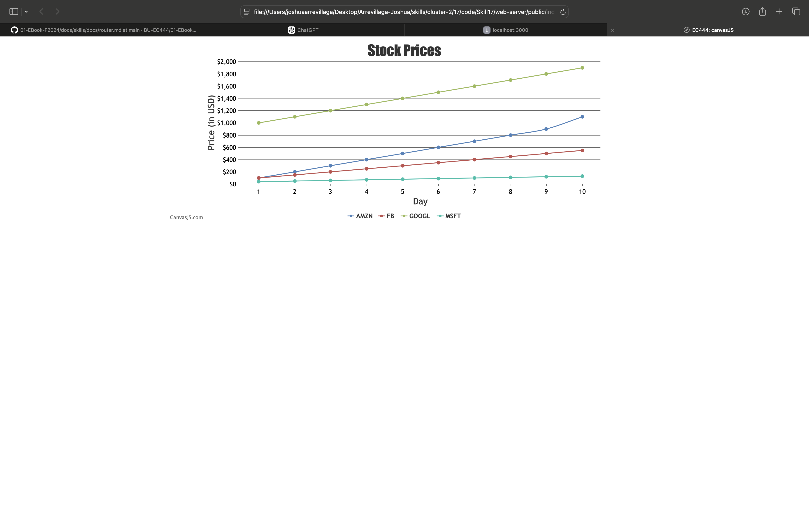

#  Skill Name

Author: Joshua Arrevillaga

Date: 2024-10-04

### Summary

I explored CanvasJS by running two example charts to familiarize with the API and then set up a Node.js app 
to serve an index.html file via an HTTP server. Initially, the CanvasJS charts ran with hardcoded data directly in the HTML, 
but I later moved the data handling to the Node app. Using Socket.IO, I enabled real-time data transfer between the Node app 
and the client-side JavaScript. To further enhance the solution, I utilized the fs.readFile() method to read data from a local CSV 
or TSV file, ensuring the Node app could dynamically provide data to the client. On the client side, I integrated matching Socket.IO 
code to receive the data and formatted it for display in CanvasJS charts. By serving the HTML through the Node server, I overcame CORS 
issues, achieving seamless communication between the backend and frontend. The final setup successfully demonstrated real-time plotting 
of external data using CanvasJS, Socket.IO, and Node.js.

### Evidence of Completion
- Attach a photo or upload a video that captures a demonstration of
  Ir solution. Include in the photo/video Ir BU ID.

Template for Including Graphics

Or

- [Link to video demo](). Not to exceed 10s

### AI and Open Source Code Assertions

- I have documented in my code readme.md and in my code any
software that we have adopted from elsewhere
- I used AI for coding and this is documented in my code as
indicated by comments "AI generated" 

