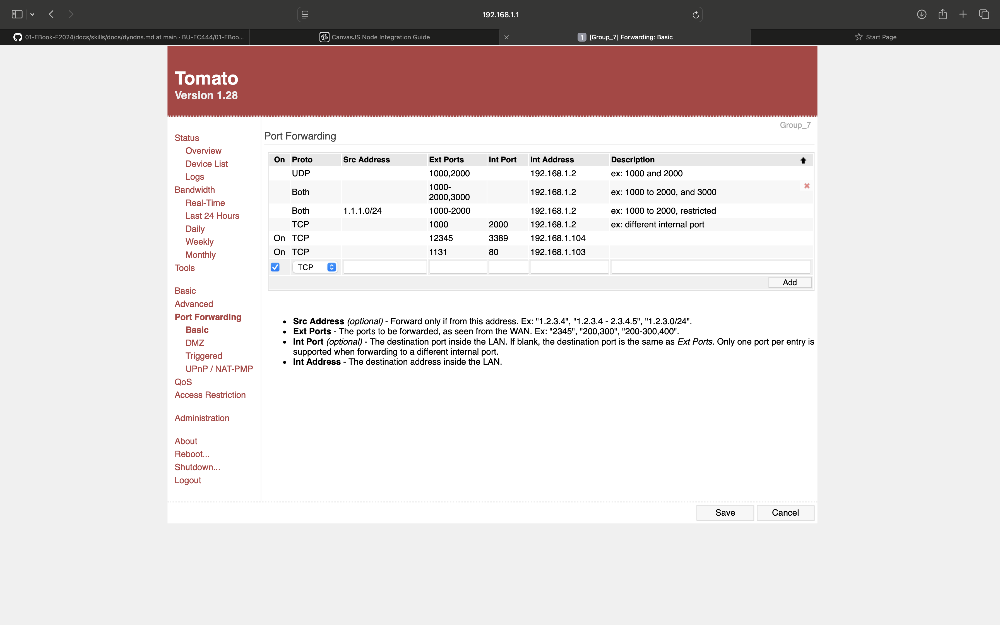

#  Skill Name

Author: Joshua Arrevillaga

Date: 2024-10-24

### Summary

This skill involves resetting and configuring a router for proper network management and remote access through Dynamic DNS (DDNS). We connected the laptop to the router via a LAN port or Wi-Fi, reset it by holding the reset button for 30 seconds, and logged in using the default credentials (root/admin) at http://192.168.1.1. We ensured the DHCP server was active, changed the SSID to Group_7, and set WPA2 Personal security with the shared key smartsys. Additionally, we configured the time zone and NTP server, updated the router password to smart, and saved the settings. Finally, we explored the device list to monitor connected devices, preparing the router for DDNS to maintain access despite changing IPs.

### Evidence of Completion
- Attach a photo or upload a video that captures a demonstration of
  your solution. Include in the photo/video your BU ID.

Template for Including Graphics

Or

- [Link to video demo](). Not to exceed 10s

### AI and Open Source Code Assertions

- I have documented in my code readme.md and in my code any
software that we have adopted from elsewhere
- I used AI for coding and this is documented in my code as
indicated by comments "AI generated" 

