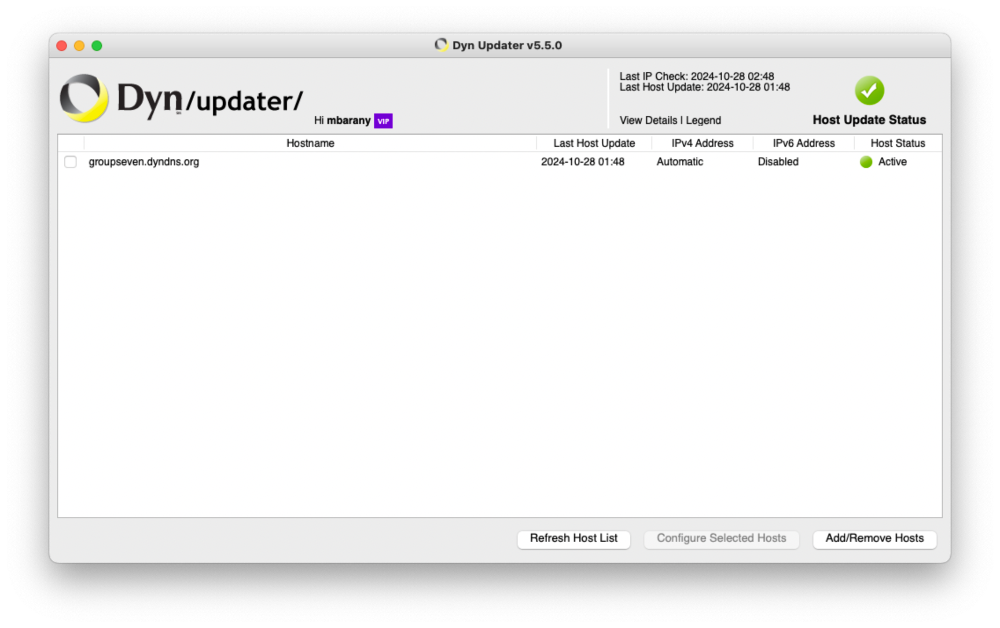
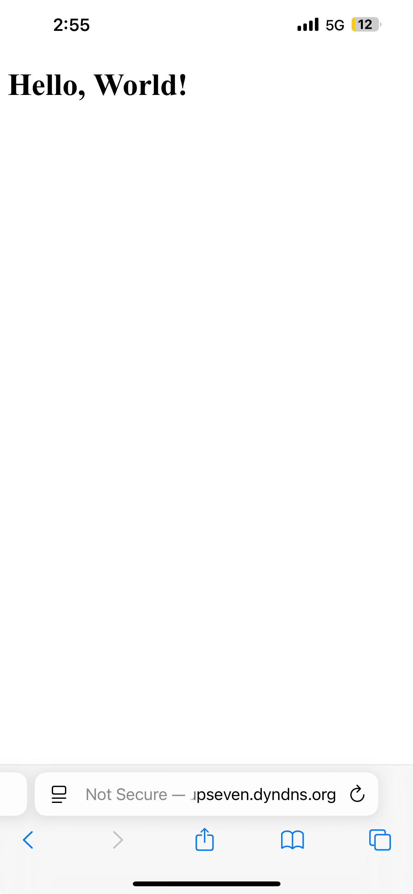
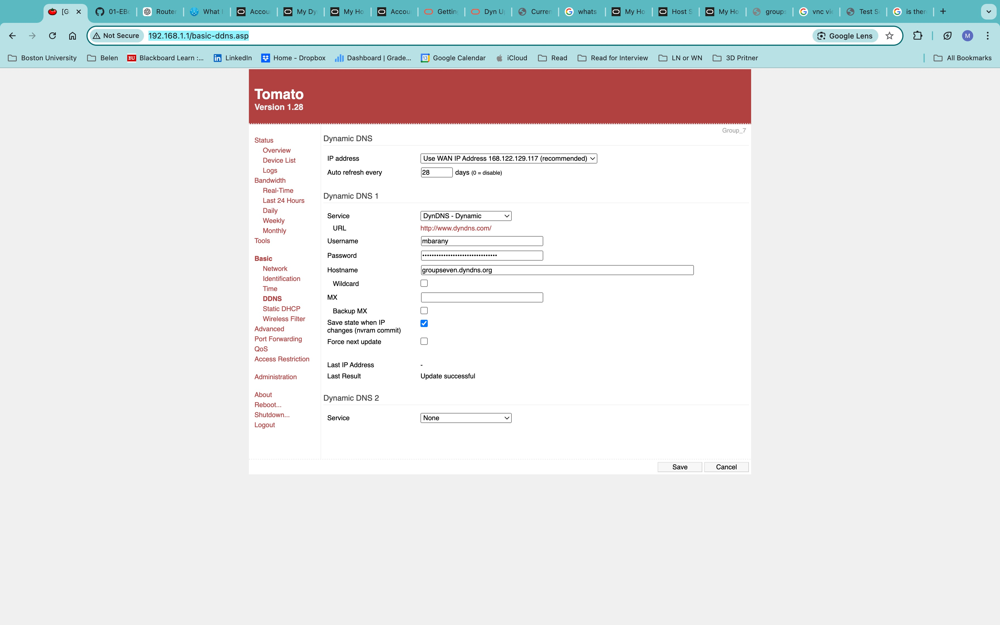
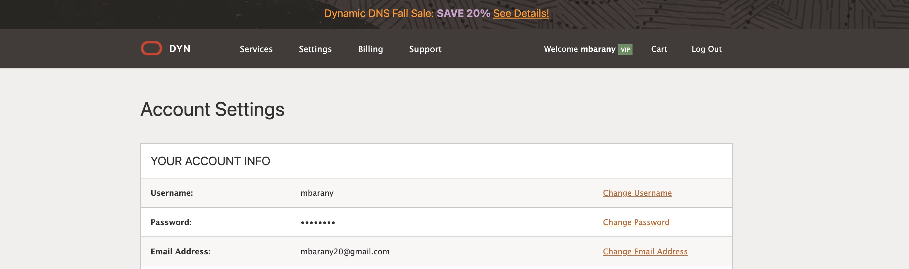

#  Skill Name

Author: Joshua Arrevillaga

Date: 2024-10-25

### Summary

Dynamic DNS (DDNS) ensures remote access to devices despite changing IPs by linking a domain name (e.g., myserver.ddns.net) to the latest IP. With routers assigning local IPs, port forwarding maps external traffic (e.g., :1131) to internal devices (e.g., 192.168.1.103:80). This skill involves setting up a Node.js server, configuring DDNS and port forwarding on the router, and accessing the server remotely using the DDNS address.

### Evidence of Completion
- Attach a photo or upload a video that captures a demonstration of
  your solution. Include in the photo/video your BU ID.

Template for Including Graphics

Or

- [Link to video demo](). Not to exceed 10s

### AI and Open Source Code Assertions

- I have documented in my code readme.md and in my code any
software that we have adopted from elsewhere
- I used AI for coding and this is documented in my code as
indicated by comments "AI generated" 

