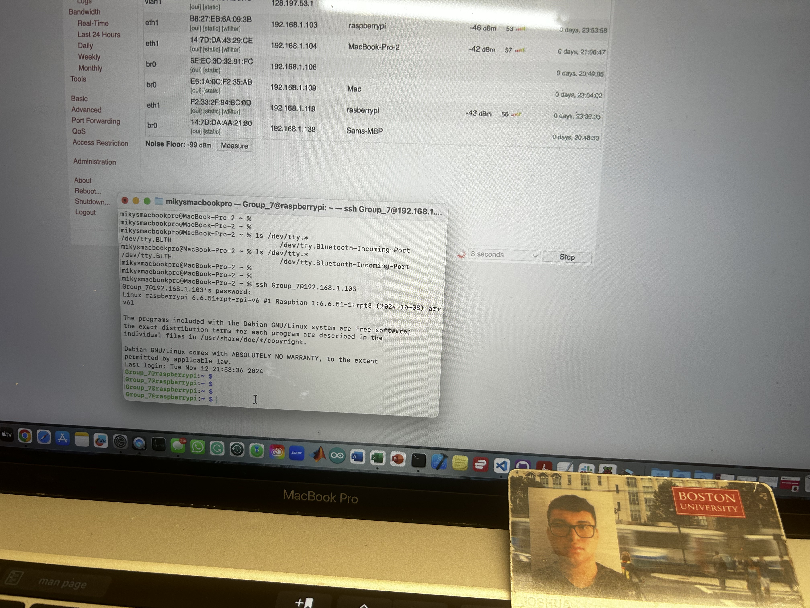

#  Skill Name

Author: Joshua Arrevillaga

Date: 2024-10-07

### Summary

This skill was about downloading the necessary software on a rapsberry pi and sshing into it and put our skills folder into. All I did was follow the steps on the skill description and followed the os installation instructions on the raspberrypi website. I then just installed node.js based on the instructions given to us

### Evidence of Completion
- Attach a photo or upload a video that captures a demonstration of
  your solution. Include in the photo/video your BU ID.

Template for Including Graphics

Or

- [Link to video demo](). Not to exceed 10s

### AI and Open Source Code Assertions

- I have documented in my code readme.md and in my code any
software that we have adopted from elsewhere
- I used AI for coding and this is documented in my code as
indicated by comments "AI generated" 

