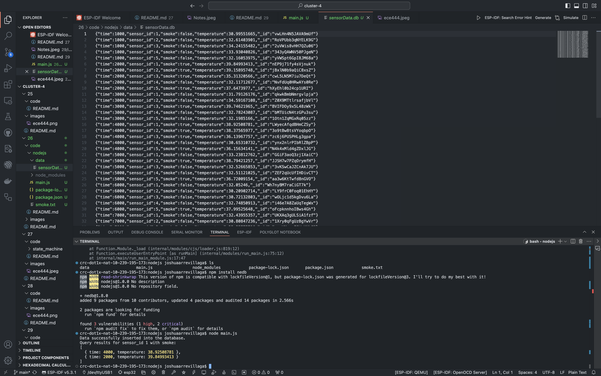

#  Skill Name

Author: Joshua Arrevillaga

Date: 2024-11-04

### Summary

In this skill, I set up a database using tingoDB to store and query sensor data from a file called smoke.txt. I wrote a script (main.js) that reads sensor data—like time, sensor ID, smoke detection, and temperature—from the file and stores it in the tingoDB database. After loading the data, I ran a query to find all times when sensor 1 detected smoke, displaying the relevant times and temperatures in the console.

### Evidence of Completion
- Attach a photo or upload a video that captures a demonstration of
  your solution. Include in the photo/video your BU ID.

Template for Including Graphics

Or

- [Link to video demo](). Not to exceed 10s

### AI and Open Source Code Assertions

- I have documented in my code readme.md and in my code any
software that we have adopted from elsewhere
- I used AI for coding and this is documented in my code as
indicated by comments "AI generated" 

