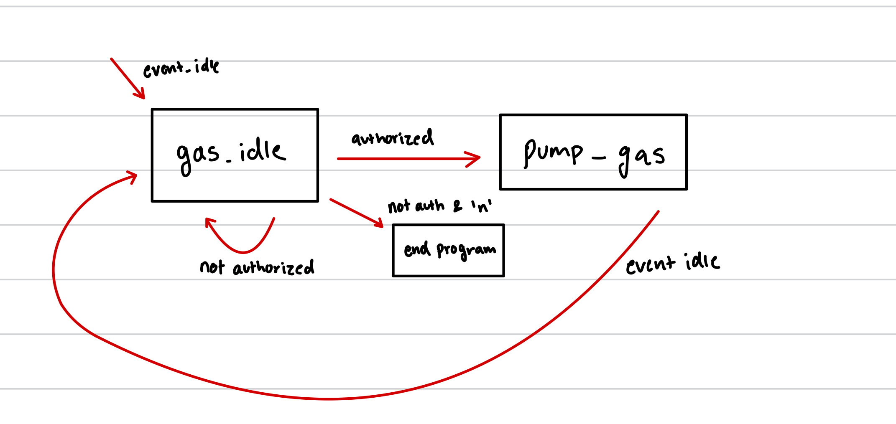

#  Skill Name

Author: Joshua Arrevillaga

Date: 2024-11-04

### Summary

There wasn't really much to this skill, I made a finite state machine for this skill and it was made to display the different states a gasoline station has. When its just there the state is idle but once the user says how much gas they want and how much money they have on hand it authorizes the user where the gasoline station begins to pump gas for a set amount of time. once it finishes it returns back to its idle state, just for functionality I programmed it just to be able to leave the program if certain conditions are met. 

### Evidence of Completion
- Attach a photo or upload a video that captures a demonstration of
  your solution. Include in the photo/video your BU ID.

Template for Including Graphics

Or

- [Link to video demo](). Not to exceed 10s

### AI and Open Source Code Assertions

- I have documented in my code readme.md and in my code any
software that we have adopted from elsewhere
- I used AI for coding and this is documented in my code as
indicated by comments "AI generated" 

