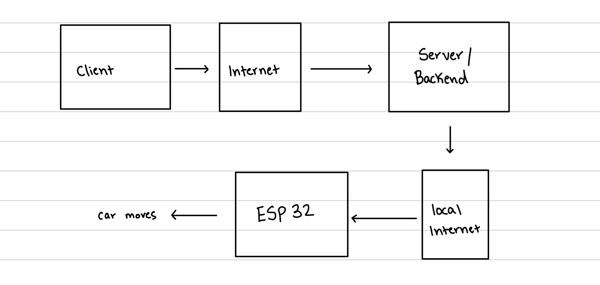

#  Skill Name

Author: Joshua Arrevillaga

Date: 2024-11-04

### Summary

2. Identify weaknesses in your overall system
 Client
  -Insecure authentications which include:
    -weak/guessable passwords
    -no multifactor authentication
  -Client side attacks
    -cross site scripting
    -injecting attacks 

  Local Network
  -weak/outdated protection protocals
  -network segmentation: weak firewall rules allowing unauthorized devices 

  Internet communication
  -MItM attacks: intercepting and changing data when communicating 
  -DoS Attacks: overwelming the server with too much traffic can disrupt the work flow

  Server
  -Dependencies: many of the installed packages can come with a lot of weaknesses
  -Insecure apis: lack of auth, invalid validation of apis
  -data exposure: exploiting sensitive data through malconfiguration

  Esp32
  -firmware vulnerabilities: 
  -physical access
  -insecure communication

  3. List at least five ways can a bad guy attack your specific system. Be very specific
  
    a. Remote Code Execution (RCE) via API Vulnerabilities:
        Attack: Exploit vulnerabilities in the Node.js backend APIs to execute arbitrary code on the server.
        Method: Send crafted requests that bypass input validation or authentication, allowing injection of malicious commands or scripts.
        Impact: Gain unauthorized control over the car/robot's operations, manipulate sensor data, or disrupt service availability.
    
    b. Eavesdropping and Replay Attacks on Communication Channels:
        Attack: Intercept and eavesdrop on communication between the client (user interface), server, and ESP32.
        Method: Capture unencrypted or weakly encrypted traffic to analyze and potentially replay commands or manipulate data.
        Impact: Capture sensitive information (e.g., control commands, sensor data), leading to unauthorized control or data manipulation.

    c. Physical Tampering and Firmware Replacement of ESP32 Device:
        Attack: Gain physical access to the ESP32 embedded device within the car/robot to alter its firmware or hardware configuration.
        Method: Disassemble the device to directly access its internal components, replacing legitimate firmware with malicious versions.
        Impact: Override safety protocols, manipulate sensor readings, or gain complete control over the car/robot's actions.

    d. Credential Stuffing and Brute-Force Attacks on User Accounts:
        Attack: Attempt to gain unauthorized access to the client (user interface) by using stolen or guessed credentials.
        Method: Employ automated tools to systematically test combinations of usernames and passwords obtained from breaches or through phishing.
        Impact: Compromise user accounts, enabling unauthorized control of the car/robot or access to sensitive data.

    e. DNS Spoofing and Man-in-the-Middle (MitM) Attacks:
        Attack: Redirect DNS resolutions or intercept traffic between the client, server, and ESP32 to manipulate data or commands.
        Method: Compromise DNS servers or use ARP spoofing techniques to redirect traffic through a malicious proxy.
        Impact: Manipulate control commands, intercept sensitive data, or inject malicious content into communications, compromising system integrity.

  4. Describe a way to mitigate each attack

  a. Always validate and filter incoming API requests to prevent malicious code injection. Use a web application firewall (WAF) to monitor and block suspicious traffic. Keep software dependencies updated to patch known vulnerabilities

  b. Encrypt all communications with strong protocols like HTTPS/TLS to prevent data interception. Use unique session tokens and rotate encryption keys regularly to thwart replay attacks.

  c. Physically secure the ESP32 device and use tamper-evident measures. Implement secure boot mechanisms to verify firmware integrity during startup. Encrypt stored data and validate firmware updates to prevent unauthorized modifications.

  d. Enforce strong password policies and implement multi-factor authentication (MFA) to protect against unauthorized access. Use account lockout and rate limiting to deter brute-force attacks. Educate users about phishing risks.

  e. Use DNSSEC to authenticate DNS responses and prevent spoofing. Employ HTTPS/TLS for secure data transmission, ensuring mutual authentication between client, server, and ESP32. Monitor network traffic for anomalies with intrusion detection systems (IDS).

### Evidence of Completion
- Attach a photo or upload a video that captures a demonstration of
  your solution. Include in the photo/video your BU ID.

Template for Including Graphics

Or

- [Link to video demo](). Not to exceed 10s

### AI and Open Source Code Assertions

- I have documented in my code readme.md and in my code any
software that we have adopted from elsewhere
- I used AI for coding and this is documented in my code as
indicated by comments "AI generated" 

