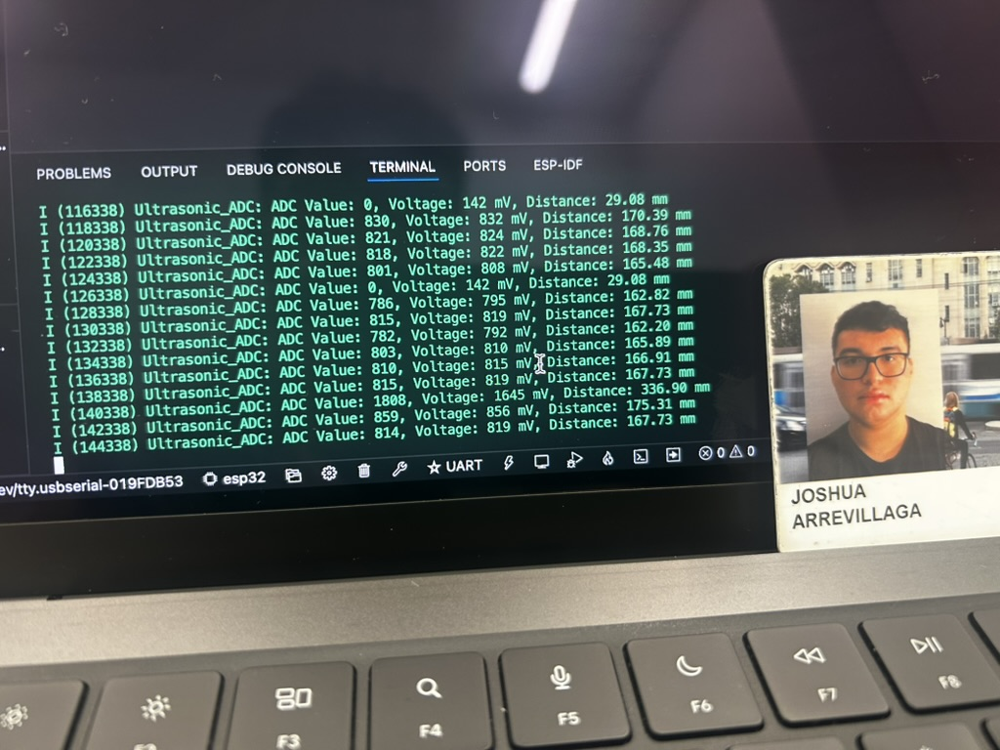

#  Skill Name

Author: Joshua Arrevillaga

Date: 2024-12-02

### Summary

The Ultrasonic Range Sensor skill involves using an ultrasonic sensor to measure the distance between the sensor and an object. Ultrasonic sensors work by emitting high-frequency sound waves and measuring the time it takes for the echo to return after hitting an object. This time delay is used to calculate the distance, which can then be converted into engineering units like millimeters or centimeters. The task focused on interfacing the sensor with the ESP32 microcontroller and reading its output using ADC (Analog-to-Digital Converter). The skill assignment required sampling the sensor data every two seconds and displaying it in engineering units on the console.

To implement this, I wired the sensor to the ESP32 ADC and configured the ADC with 12-bit resolution and appropriate attenuation to match the sensor’s voltage output range. Using ESP-IDF's adc_oneshot API, I initialized the ADC unit and enabled optional line-fitting calibration for increased accuracy. The raw ADC readings were converted into millivolts and then translated into distance using the sensor's specifications. The code ensures continuous sampling and logs the distance, voltage, and raw ADC values every two seconds. Calibration support was included to minimize inaccuracies due to supply voltage variations.

This implementation demonstrates the integration of an analog ultrasonic sensor with a digital microcontroller, emphasizing concepts like ADC configuration, signal conversion, and calibration. The solution provides accurate real-time distance measurements, highlighting the sensor’s capabilities for applications like obstacle detection, spatial mapping, and automation. The approach ensures robust performance, even in scenarios where calibration is unavailable, making it a versatile tool for proximity sensing.

### Evidence of Completion
- Attach a photo or upload a video that captures a demonstration of
  your solution. Include in the photo/video your BU ID.

Template for Including Graphics

Or

- [Link to video demo](). Not to exceed 10s

### AI and Open Source Code Assertions

- I have documented in my code readme.md and in my code any
software that we have adopted from elsewhere
- I used AI for coding and this is documented in my code as
indicated by comments "AI generated" 

