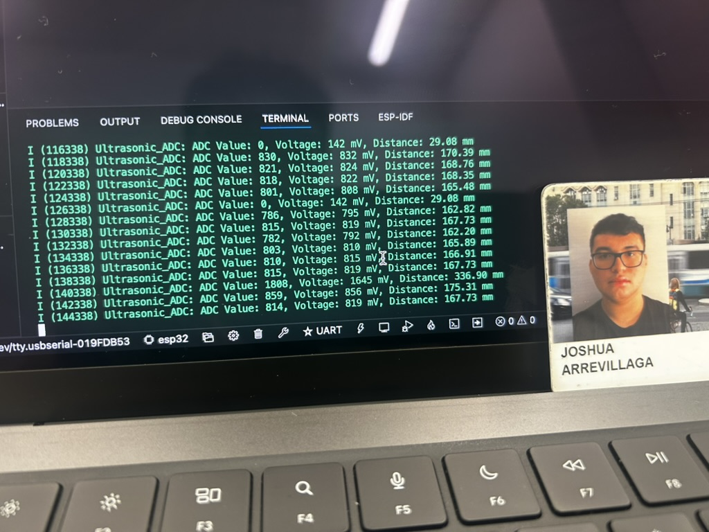

#  Skill Name

Author: FirstName LastName

Date: 2024-12-02

### Summary

The Sharp IR Range Sensor skill focuses on measuring distances using an IR sensor, which reflects infrared light off objects and detects the reflection to determine distance. The skill involves integrating the Sharp IR sensor with an ESP32 microcontroller, leveraging its ADC (Analog-to-Digital Converter) capabilities. The sensor's output is an analog voltage that correlates to distance, requiring a calibration process to convert raw ADC values into engineering units, such as centimeters. The assignment involves configuring the ADC, collecting data, and curve-fitting the voltage-to-distance relationship to ensure accurate measurements across the sensor's range.

To implement this skill, I configured the ESP32 ADC with a 12-bit resolution and appropriate attenuation settings for the sensor's output range. I initialized and calibrated the ADC using ESP-IDF’s adc_oneshot API and an optional line-fitting calibration scheme for improved accuracy. The ADC reads raw values, which are converted into millivolts and then translated into distance using a mathematical formula derived from sensor specifications and testing. The system was set to sample data every 2 seconds, displaying the ADC value, voltage, and calculated distance on the console. When the sensor detected objects outside its range, the code appropriately flagged them as "Out of range."

The result is a reliable system capable of measuring distances in real-time within the sensor's range. The calibration process ensures accuracy, while the engineering unit conversion provides meaningful output. This skill demonstrates key concepts like analog signal processing, ADC calibration, and mathematical modeling. It highlights the importance of configuring hardware and software systems to adapt to sensor characteristics, ensuring precise and practical use in real-world applications.

### Evidence of Completion
- Attach a photo or upload a video that captures a demonstration of
  your solution. Include in the photo/video your BU ID.

Template for Including Graphics

Or

- [Link to video demo](). Not to exceed 10s

### AI and Open Source Code Assertions

- I have documented in my code readme.md and in my code any
software that we have adopted from elsewhere
- I used AI for coding and this is documented in my code as
indicated by comments "AI generated" 

