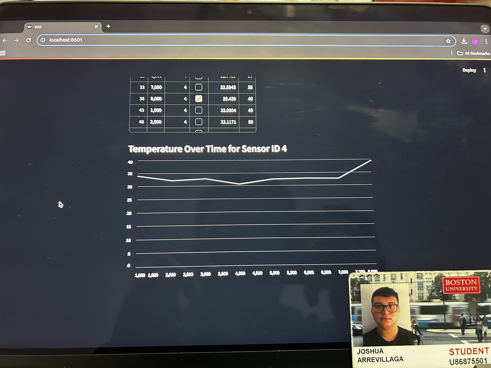

#  Skill Name

Author: Joshua Arrevillaga

Date: 2024-12-02

### Summary

The Streamlit-based visualization skill integrates a Python framework with TingoDB to analyze and visualize collected data interactively. Here's a summary:

This skill demonstrates the use of Streamlit, a Python-based web app framework, to create an intuitive interface for accessing and visualizing data stored in a TingoDB instance. A Python wrapper (tingodb_wrapper.py) provides functions for connecting to the database and retrieving data, while the Streamlit app (app.py) visualizes this data with rich features such as filters and line charts. The database stores sensor readings, including temperature data over time, which can be dynamically explored using the web interface.

To implement this skill, TingoDB was used to emulate a MongoDB-like database environment for lightweight storage. The wrapper provides abstraction for database interactions, enabling seamless integration with Streamlit. The app loads sensor data from a JSON file and converts it into a Pandas DataFrame for manipulation. Users can explore raw data, filter it by sensor ID, and visualize temperature trends over time using dynamic charts and interactive widgets. Features such as filtering and conditional plotting enhance usability.

This solution successfully highlights the power of Streamlit in transforming raw data into meaningful visual insights. By integrating TingoDB, it ensures an accessible and lightweight database backend. The project showcases how modern Python tools can simplify database interaction and data visualization while enabling interactivity for end users.

### Evidence of Completion
- Attach a photo or upload a video that captures a demonstration of
  your solution. Include in the photo/video your BU ID.

Template for Including Graphics

Or

- [Link to video demo](). Not to exceed 10s

### AI and Open Source Code Assertions

- I have documented in my code readme.md and in my code any
software that we have adopted from elsewhere
- I used AI for coding and this is documented in my code as
indicated by comments "AI generated" 

